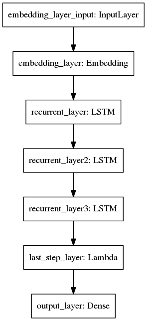
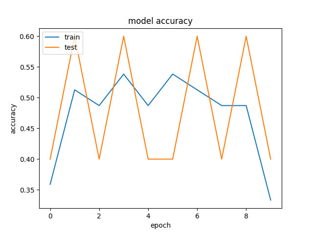
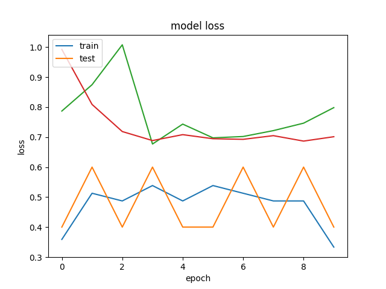

# dna_lstm
LSTM for binary sequence classification

## about

structure of training data (see `input.csv`)

```
sequence,class
ACGTAGCT,1
ACCCTAAG,1
TCGTAACG,0
```




## install

```
sudo apt-get install graphviz
virtualenv env
source env/bin/activate
pip install matplotlib keras h5py tensorflow numpy pandas pydot-ng pydot graphviz
```

### usuage

#### training

```
python train.py
```

final model will saved to `model.json` and `model.h5` plus plots `accuracy.png` and `loss.png`




#### prediction

this script will use the model generated in the training process to predict list of sequences found in `test.csv`

```
python predict.py
```

